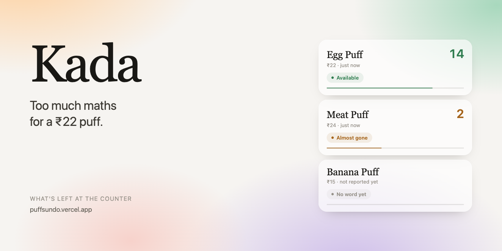
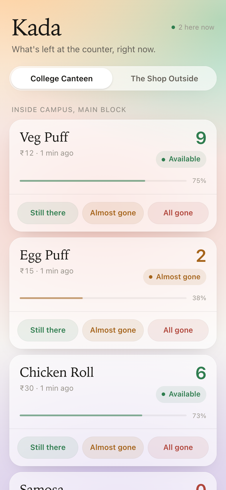
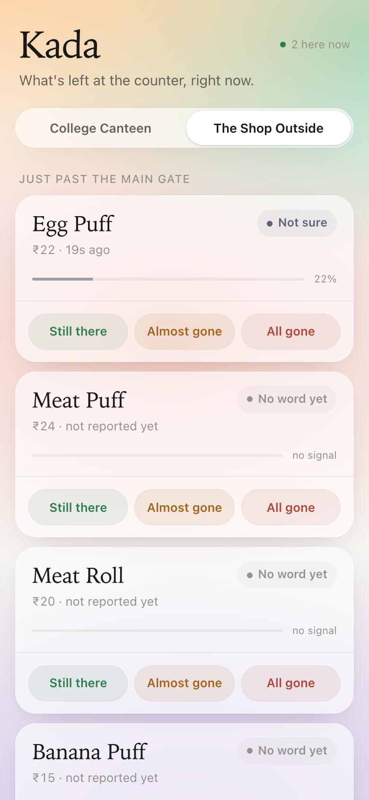
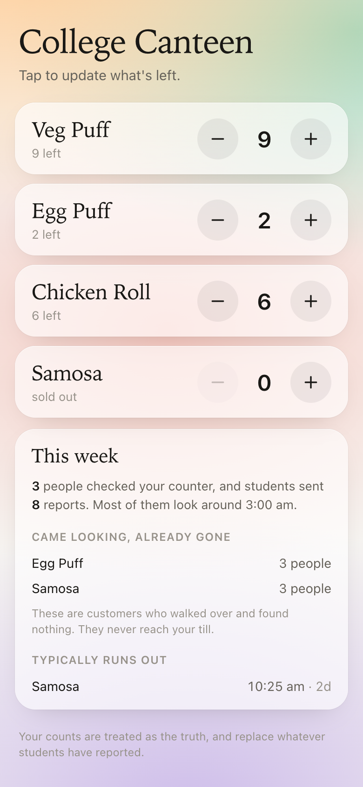
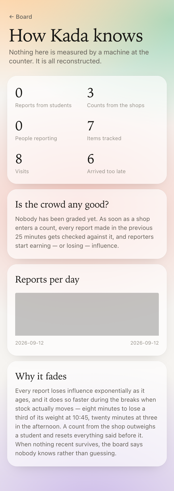
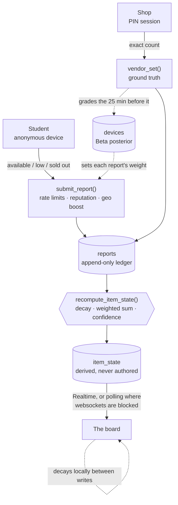

# Kada 🎯


## Basic Details
### Team Name: Aromal S D (Individual)


### Team Members
- Team Lead: Aromal S D - [College of Engineering Perumon]

**Live at [puffsundo.vercel.app](https://puffsundo.vercel.app)**

### Project Description
Kada tells you whether there are puffs left, before you walk to the counter and find out the
hard way.

Neither shop has a till, a barcode scanner, or the slightest interest in acquiring one. So rather
than reading stock from a system, Kada reconstructs it — from what the shopkeeper says, what
students report, and a scoring model that trusts every one of them slightly less as the minutes
pass.

It is a distributed consensus system. It is about puffs.

### The Problem (that doesn't exist)
You walk forty metres to the canteen. The puffs are gone. You walk forty metres back.

This has happened to students for as long as canteens have existed, and everyone has coped,
because the fix is to look at the counter with your eyes. Nobody has filed a complaint. There is
no market. The entire cost of the problem is forty metres and a small private disappointment.

We decided this was unacceptable.

### The Solution (that nobody asked for)
We applied Byzantine fault tolerance to a ₹12 snack.

Every student report enters a consensus model as an untrusted claim. It is weighted by that
reporter's Beta-distributed reputation, multiplied by 1.4 if their phone can prove they are
actually standing at the counter, and decayed exponentially — with a shorter half-life during
break hours, because puffs move faster at 10:45 than at three in the afternoon. When the
shopkeeper enters a real count it becomes ground truth, wipes the ledger, and retroactively
grades everyone who spoke in the previous twenty-five minutes. Lie about puffs often enough and
the system quietly stops believing you. It never mentions this.

The board will also admit when it has no idea, which turned out to be the hard part. It is very
easy to build something that always sounds confident. It is considerably harder to build
something willing to say *nobody has looked recently*.

Seven items. Two shops. Twenty-eight unit tests, none of which are about food.

It works, which is somehow the most upsetting part.

## Technical Details
### Technologies/Components Used
For Software:
- **Languages:** TypeScript, SQL (PostgreSQL / PL/pgSQL)
- **Frameworks:** Next.js 16 (App Router), React 19
- **Libraries:** Tailwind CSS v4, Motion, Zod, supabase-js, sonner, lucide-react, Vitest
- **Tools:** Supabase (Postgres, Realtime, RLS), Vercel, GitHub Actions

For Hardware:
- Not applicable — this project is software only.

### Implementation
For Software:

# Installation
```bash
git clone https://github.com/aromalsd/Puffs-undo.git
cd Puffs-undo
npm install
cp .env.local.example .env.local   # then fill in your Supabase values
npm run migrate                    # creates the schema and seeds both outlets
```

# Run
```bash
npm run dev        # http://localhost:3000
npm run test       # scoring engine unit tests
npm run typecheck  # strict TypeScript, no emit
```

### Routes
| Path | What it is |
|---|---|
| `/` | The public board. `?shop=<slug>` opens a specific outlet. |
| `/vendor` | The shop's counter console, behind a PIN. |
| `/stats` | What the board is built from, and how accurate it has been. |
| `/codes` | Printable QR codes to stick at each counter. |

### How it actually works

Availability is never stored as a boolean. Every signal lands in an append-only `reports` ledger
and the derived state is recomputed on write.

**Scoring.** Each report carries a weight fixed at write time: `0.35 × reputation` for a student,
`1.0` for the shop, multiplied by `1.4` when the browser confirms the reporter is within 80 m of
the counter. Weights decay as `w(t) = w₀ · e^(−Δt/τ)`, where `τ` is 8 minutes inside the campus
rush windows and 20 minutes otherwise. The signed sum `S = Σ wᵢ·sᵢ` (`available` = +1,
`low` = +0.2, `sold_out` = −1) yields `confidence = |S| / (|S| + 1.2)`, and the state is
`available` above +0.4, `sold_out` below −0.4, `uncertain` between, and `unknown` when no
surviving weight clears the floor. One person shouting "sold out" therefore moves the board to
*Unclear*, not to *Sold out* — it takes corroboration.

**Reputation.** Every device carries a Beta posterior seeded neutral at (2, 2). When the shop
enters a count, the reports made in the preceding 25 minutes are graded against it and each
reporter's α or β moves. The weight multiplier is the posterior mean, clamped to [0.1, 1.5], so a
persistent liar's influence decays toward nothing without ever being told they were muted.

**Integrity.** Row Level Security is on for every table and the client cannot insert anything:
`reports`, `devices`, `vendor_sessions` and `pin_attempts` have RLS enabled with no policies and
no privileges. All writes go through `SECURITY DEFINER` functions that enforce their own limits —
one report per device per item per 90 seconds, twenty per device per hour, and an IP-hash ceiling
that survives someone clearing their local identifier. Shop access is a bcrypt-hashed PIN,
throttled to five attempts per fifteen minutes.

**Resilience.** The board subscribes to Postgres changes over websockets and falls back to HTTPS
polling automatically when websockets are blocked, which many campus networks do. Because the
scoring model is a pure function shared by client and server, confidence keeps decaying in the
browser between updates with no database load at all.

**Closing the loop.** Reports are graded, so each reporter can see what their word is currently
worth. The shop gets the one figure it cannot observe from behind the counter — how many people
came looking after something had already run out — which is what gives it a reason to keep
entering counts, and the counts are what keep the whole model honest.

### Project Documentation
For Software:

# Screenshots


*The board. Each item shows the shop's own count where one is fresh, the state it implies, and how
confident the model currently is — and that confidence is already falling as you read it.*


*One student reporting "all gone" does not flip the board. It moves to **Not sure** at just over
20%, because a single unverified voice is not evidence. The items below it say **No word yet**
rather than guessing — the interface is not allowed to overstate what it knows.*


*What the shop sees. Oversized steppers usable with one thumb in about three seconds, and beneath
them the figure a till can never show: people who walked over after something had already run out.*


*The public accounting. Every claim the board makes about its own accuracy is checkable here.*

# Diagrams



*Nothing writes availability directly. Reports land in an append-only ledger, a trigger collapses
them into derived state, and that is the only table a client can read. A count from the shop resets
the ledger for that item and grades whoever spoke just before it.*

---
Made with ❤️ at TinkerHub Useless Projects 


